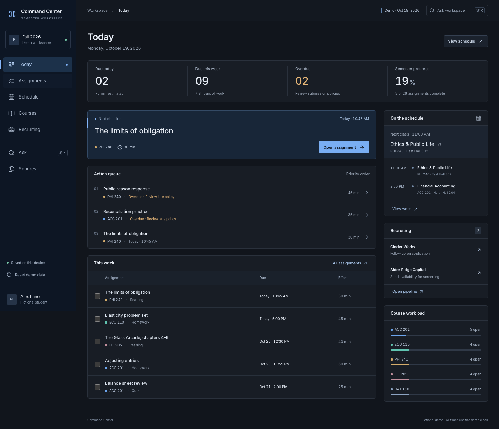

# Command Center

Command Center is my academic and recruiting workspace, built with Next.js, React and
TypeScript. It brings assignments, schedules, course materials, application tracking
and record search into one interface.

All people, courses, assignments, applications, and source records in this repository are fictional demo data.

## Why I built it

Deadlines, course policies, materials and recruiting follow-ups usually live in separate
systems. I wanted one daily view that could answer practical questions without losing
the source behind each answer. The result is a local-first workspace: completion and
pipeline edits persist in the browser, while search responses cite the records they use
and say when the available data cannot answer a question.

## Live site

[personal-command-center-kappa-six.vercel.app](https://personal-command-center-kappa-six.vercel.app)



## Features

- Today dashboard with deadlines, workload, classes, and recruiting follow-ups
- Assignment search, filters, sorting, detail views, and saved completion state
- Weekly schedule for classes, deadlines, interviews, and follow-ups
- Course details with grading policies, materials, meetings, and upcoming work
- Recruiting pipeline with editable stages and follow-up dates
- Record search with cited sources and clear missing-information responses
- Responsive layouts for desktop, tablet, and mobile

## Design choices

- Domain selectors keep scheduling and prioritization logic separate from the interface.
- Search uses deterministic record retrieval rather than generated answers.
- Browser storage is validated before saved state is loaded.
- Source links stay attached to assignments, course policies and recruiting records.
- The same fixture clock drives dashboards, filters and tests, so time-dependent views
  remain reproducible.

## Development

Requires Node.js 22.13 or newer.

```bash
npm ci
npm run dev
```

## Checks

```bash
npm run typecheck
npm run lint
npm test
npm run build
```

Browser tests require Chromium:

```bash
npx playwright install chromium
npm run test:e2e
```

## Project structure

```text
src/app          Next.js application entry and styles
src/components   Workspace views and shared interface components
src/domain       Types, selectors, persistence, and record search
src/fixtures     Fictional semester data
tests            Unit and browser tests
docs/screenshots Product screenshots
```

## License

MIT. Third-party notices are listed in [THIRD_PARTY_NOTICES.md](THIRD_PARTY_NOTICES.md).
